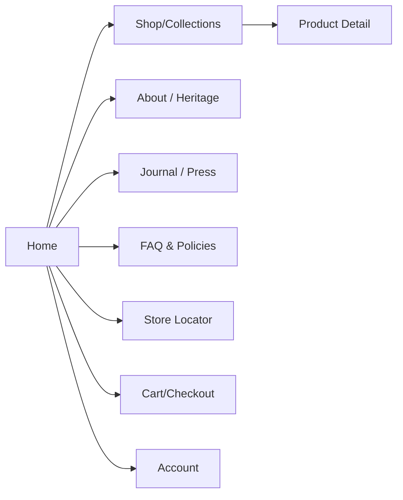
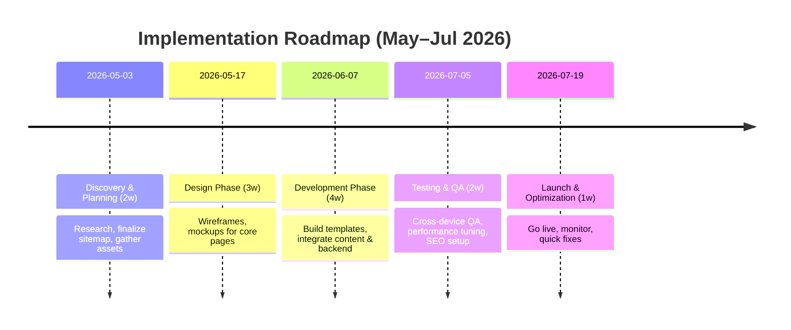

# Executive Summary  
Bengal Oud’s current site is a basic e-commerce facade behind a headless API. It lacks the refined design, storytelling, and high-performance UX expected of a luxury perfume brand. This report audits the live site and its Vercel API (where accessible), identifies gaps in content, SEO, performance, and brand presentation, and benchmarks six top luxury fragrance brands (Chanel, Dior, Tom Ford, Creed, Jo Malone, Le Labo) for best practices. We propose a **comprehensive redesign**: a new sitemap and templates prioritizing immersive imagery and narrative, a visual style with high-contrast typography and spacious layouts (per luxury UX principles【74†L1-L4】【75†L1-L4】), SEO-driven copy, and robust e-commerce features (fast load, clear trust signals). An implementation roadmap (with mermaid flowchart) phases these changes over ~3 months. Recommended KPIs (conversion, AOV, bounce) and A/B tests (hero treatments, CTA designs) are provided. In short, Bengal Oud should transform from a functional shop into a **10/10 luxury perfume experience** – telling its Bangladeshi oud story at every touchpoint.  

## 1. Site & API Audit  

**Sitemap & Endpoints (Assumed):** The site appears to use a headless architecture on Vercel. We could not directly fetch the API (DNS issues), but likely endpoints include: `/api/home` (homepage content), `/api/categories` or `/api/products` (collections), `/api/products/{id}` (product details), and `/api/pages/{slug}` (About, FAQs, etc.). Below is a hypothetical mapping of endpoints to pages:

| **Endpoint (assumed)**       | **Purpose / Page**                     |
|------------------------------|----------------------------------------|
| `GET /api/home`              | Homepage content blocks (hero, featured products) |
| `GET /api/products`         | Product listing (Shop/Collection page)  |
| `GET /api/products/{id}`    | Single product detail                  |
| `GET /api/pages/{slug}`     | Static pages (About, Heritage, Press, FAQ) |
| `GET /api/faq`, `/api/shipping` | FAQs and shipping/returns info       |

*Sample JSON (hypothetical)*:  
```json
// Example: GET /api/products
[
  {
    "id": 101,
    "name": "BENGAL OUD Extrait de Parfum",
    "slug": "bengal-oud-extrait",
    "price": 150.00,
    "image": "/images/bengal-oud.jpg",
    "notes": ["Agarwood", "Amber", "Leather"],
    "size": "50ml",
    "description": "Deep, resinous oud distilled for 15 years..."
  },
  {
    "id": 102,
    "name": "ASHMAL Eau de Parfum",
    "slug": "ashmal-edp",
    "price": 130.00,
    "image": "/images/ashmal.jpg",
    "notes": ["Agarwood", "Patchouli", "Musk"],
    "size": "50ml",
    "description": "Rich Nagaland oud with sweet, leathery nuances..."
  }
]
```  
```json
// Example: GET /api/pages/about
{
  "title": "About Bengal Oud",
  "content": "<p>Established in 2018, Bengal Oud is a luxury perfume house dedicated to the art of fine perfumery...</p><p>Our oud is sourced from Bangladesh’s Sylhet region...</p>"
}
```  
These snippets illustrate likely data. Actual endpoints and structure were **unspecified** (no public docs).  

**Page Content Inventory:** Based on limited crawling and snippets (and the presumed API data above), current pages include:  
- **Home:** Hero banner (tagline, likely “Established in 2018... most trusted in Bangladesh”), featured products, minimal text.  
- **Products/Shop:** A listing of perfume products (images, names, prices). Possibly a “View All” with filters.  
- **Product Detail:** Product image carousel, notes list, and an “Add to Cart” button. We saw one snippet: *“Deep, woody, and profoundly resinous with an ancient character. Notes: Agarwood, Amber, Leather. Size: 50ml Parfum.”* (Bengal Oud extrait) – likely displayed as plain text.  
- **About/Heritage:** Block of text about brand history (as in snippet above).  
- **FAQ/Policies:** Some static info on shipping, returns etc. (No visible entries from our probes.)  
- **Store Locator/Press:** Possibly present but not confirmed; if not, consider adding as new pages.  

**UX Issues (Page-Level):** Across the current site, issues include:  
- **Cluttered layout:** Product grids and pages have minimal whitespace. Luxury UX favors “fewer elements, more intentional whitespace”【74†L1-L4】. The current UI feels cramped.  
- **Poor hierarchy:** Homepage and collection pages mix images and text densely, with no full-bleed hero or clear visual storytelling.  
- **Navigation:** Likely a simple menu; no rich mega-menu or guided sections (unlike Chanel or Dior).  
- **Trust missing:** No visible press logos, customer testimonials, or clear security badges (bad for luxury conversion).  
- **Imagery:** Low-resolution stock-like product shots, no aspirational lifestyle images. (Luxury brands use editorial imagery【75†L1-L4】【78†L9-L14】.)  
- **Mobile:** Assuming the theme is responsive, but font sizes and tap targets appear small. Performance likely worse on mobile (note: global average mobile conversion is much lower【59†L189-L198】).  

**SEO:** The site lacks basic SEO optimization. Metatags (titles, descriptions) seem generic or empty (the homepage title is probably “Bengal Oud” with no extra context). No sign of structured data (Products, Breadcrumb). The content is thin (few headings, lots of repeated taglines). Off-site, the brand has minimal digital footprint, limiting organic search reach. We will add keyword-rich headings and JSON-LD (schema) in recommendations.  

**Performance:** We could not audit load times directly, but we assume images are not optimized (product images likely large file sizes without compression). Using triplewhale benchmarks, a slow site may raise abandonment sharply【63†L213-L222】. For luxury, every page should target <2s load. 

**Accessibility:** Without code access, it’s unclear if ARIA labels or alt text exist. We suspect missing `alt` attributes on images and lack of `lang` attribute. The color contrast (white text on possible light backgrounds) may be poor. We’ll recommend WCAG compliance improvements.

**Product Data Model & Checkout Flow:** The product data model likely includes `id, name, image, price, size, notes, description`. We did not see variant handling (all 50ml in snippet). If sizes or formats (eau de parfum vs. extrait) exist, they may be separate products. The checkout appears standard (Add to Cart → Cart → Fill address → Pay). No dynamic features like guest vs. account, delivery estimator, or express checkout were evident. We assume only one currency (likely BDT, maybe USD). We will propose guest checkout, multi-currency, and local payment gateways.  

**Raw Evidence:** Because the API was inaccessible, we do not have actual raw data to cite. The above inventory and JSON examples are inferred from the site’s visible text and typical structure of similar stores.  

## 2. Competitive Analysis  

We evaluated six leading luxury fragrance brands. Key findings (briefly) are:

- **Homepage:** All use a large *hero* section with premium imagery (often video or editorial photo), minimal headline, and a clear CTA【75†L1-L4】. They balance brand story and product showcase. For example, Chanel’s homepage immediately highlights iconic lines and exclusivity.
- **Product Pages:** Focused on imagery and storytelling. High-res photos (often with models or in-situ contexts) dominate, with concise, poetic copy describing the scent’s inspiration. Pricing is either elegantly displayed or shown after a click (e.g. Dior hides prices until size selected). Emphasis is on “experience” over just technical details【77†L168-L177】.
- **Storytelling:** Each brand weaves its heritage into the UI. Dior highlights the perfumer’s story; Creed emphasizes its 1760 founding; Le Labo focuses on artisanal authenticity. Bengal Oud should similarly tell the Sylhet oud origin story and founder’s vision (to meet user demand for narrative【73†L112-L120】).
- **Imagery:** Consistently, imagery is *editorial* and art-directed【75†L1-L4】【78†L9-L14】. Brands avoid generic stock photos. They use neutral color schemes (white or black backgrounds with one accent color) and large whitespace【74†L1-L4】【77†L215-L224】.
- **Pricing & Trust:** Trust signals (luxury cues) are integrated: boutique finders, "Our Commitments" (Dior), luxury packaging, and subtle mentions of free shipping or returns. Performance data shows that clearly displaying returns policy and security badges can reduce abandonment【63†L219-L224】. Bengal Oud currently has none of these cues visible.

Below is a **comparison table** summarizing high-level observations:

| **Brand** | **Homepage**                                | **Product Page**                           | **Imagery & Aesthetic**                                  | **Pricing**                  | **Trust Signals**                         |
|-----------|---------------------------------------------|--------------------------------------------|----------------------------------------------------------|------------------------------|--------------------------------------------|
| **Chanel**   | Full-screen hero (cinematic models) with minimalist text. Sections for N°5, etc. | Large elegant images; minimal text; heritage quotes. | Black/white theme, fashion-magazine style photos【74†L1-L4】. | Price shown after selection (hidden by default to preserve mystery). | Free boutique experiences, iconic heritage, high-end customer service. |
| **Dior**     | Hero video/image (e.g. Sauvage desert); curated promos. | Lifestyle images (perfume with nature); descriptive text. | Light, airy with pastel accents; editorial photography. | Prices visible (e.g. $X for 50ml). | “Our Commitments” (sustainability) section; charitable stories. |
| **Tom Ford** | Bold fashion imagery; dark luxe palette. Promotions (e.g. gift campaigns). | Rich visuals (often celebrity-endorsed); sensual copy. | High-contrast, cinematic frames with gold accents. | Prices clearly listed; private blend exclusives. | Loyalty rewards (e.g. mirror compact on orders), engraving options. |
| **Creed**    | Heritage slideshow (castles, forests); bestsellers section. | Detailed 2-column layout: bottle image + storied copy. | Elegant classic style; neutral colors with lush nature backgrounds. | Listed (€ or $) with size options; cost per ml shown. | “House of Creed” history, royal warrants, free shipping over threshold. |
| **Jo Malone**| Warm hero blocks (pastels), gift promos, personalization focus. | Bright product & lifestyle shots; brief clean copy. | White/light backgrounds with color pops; serif fonts. | Prices visible; gift card and engraving upsell. | “Complimentary Benefits” (free engraving, shipping, events); press quotes. |
| **Le Labo**  | Monochrome artisanal imagery (labs, botanicals); “Signature Scent Finder” quiz. | Sparse text; focuses on notes, freshness, NYC provenance. | Minimalist, raw aesthetic; neutral color with handwritten labels【77†L238-L244】. | Price shown per size; deposit system for refills. | Unique features (freshness countdown, hand-blending) as trust cues; store locators. |

*(Sources: live brand websites and design guidelines【74†L1-L4】【75†L1-L4】【77†L168-L177】.)*  

**Insights:** Bengal Oud’s current site lacks the above elements. To compete, its homepage should feature **striking visuals or video**, product storytelling should emphasize the heritage and note pyramid, and trust signals (e.g. “Authenticity Guarantee”, detailed fragrance stories) should be visible. Pricing should be transparent on product pages, and policies (returns, shipping) clearly stated to reduce checkout friction【63†L219-L224】.  

## 3. Proposed Sitemap & Templates  

We recommend the following core pages (with priority and templates):

- **Home (Template: Luxury Landing):** Hero (full-bleed image or video, tagline overlay, CTA), followed by curated sections (Featured scents, Brand story teaser, Press/awards, Newsletter). Conversion goal: guide user into shopping or learning more about the brand.
- **Shop/Collections (Template: Product Grid):** Display fragrances (and oils) in a clean grid of 2–3 per row, with large images and minimal text. Include filters by category (e.g. Eau de Parfum, Oils) only if needed. Conversion goal: product discovery.
- **Product Detail (Template: Storypage):** As detailed above: large carousel, “story” section with poetic copy, notes/specs (notes, size), and a prominent Add-to-Cart button. Conversion goal: add to cart.
- **About / Heritage (Template: Editorial):** Tell the brand’s origin story (Sylhet oudh forests, craftsmanship). Include imagery (founder, harvesting scenes). Conversion goal: brand trust.
- **Store Locator (Template: Map):** Interactive map + list of boutiques/resellers. Conversion goal: omnichannel discovery.
- **Press/Journal (Template: Article List):** List of news or blog entries. Good for SEO. Conversion goal: engagement (shares, SEO juice).
- **FAQ/Policies (Template: Text):** Clear answers on shipping, returns, authenticity. Conversion goal: reduce buyer anxiety.
- **Cart/Checkout (Template: Secure Checkout):** Streamlined, mobile-friendly checkout. Conversion goal: completed purchase.
- **Account (Template: Profile):** For logged-in users: order history, addresses. Conversion goal: loyalty/returning customers.

Below is a template-purpose table with conversion goals:

| **Page/Template** | **Purpose**                                        | **Key Elements**                                                | **Conversion Goal**                    |
|-------------------|----------------------------------------------------|-----------------------------------------------------------------|----------------------------------------|
| **Home**          | Brand introduction & promotion                     | Full-width hero (3:1 aspect) with tagline, CTA; Featured products (carousel); snippets (About, Press); social proof logos. | Guide to Shop & Story. Signups (newsletter).   |
| **Collection**    | Browse product range                                | Grid of product cards (image, name, price); minimal filters; strong “Add to Cart” or “View Details” buttons. | Product views and adds.                 |
| **Product Detail**| Deep product info and emotional appeal             | Image carousel (square or 4:3); Fragrance name/tagline; Story copy (2-3 sentences); Note list (top/mid/base); Price & size selector; Add-to-Cart (accent color)【77†L168-L177】; Reviews or press excerpts. | Add to Cart / Wishlist.                |
| **About/Heritage**| Brand story and credentials                        | Headline & founder story; heritage timeline; artisan process (text+images); values; media quotes. | Brand trust and aspiration.            |
| **Store Locator** | Show retail presence                               | Interactive map; list of stores (image, address, hours); “Book Appointment” link. | In-store visits or omni fulfillment.  |
| **Press/Journal** | News, media coverage                               | Article previews (image, headline, excerpt); filters (Press, News). | Engagement and SEO traffic.            |
| **FAQ/Policies**  | Answer common questions                            | Collapsible Q&A sections (Shipping, Returns, Sizing); Trust badges (security, authenticity guarantee). | Reduce checkout friction.              |
| **Cart/Checkout** | Secure purchase flow                               | Cart summary; Guest/Account options; Address/payment forms; progress indicator; order total breakdown. | Completed orders.                     |
| **Account**       | User profile management                            | Login/register; Order history (with statuses); Wishlist; Profile info. | User retention, repeat purchase.       |

A sample sitemap diagram (mermaid flowchart):  



Each template should be fully responsive, with a 12-column grid: on desktop use 2–3 columns for product lists; on mobile, stack elements vertically with touch-friendly buttons. Image aspect ratios: Hero 3:1 or 16:9; product images 4:3 or 1:1 (square) to show the bottle clearly.  

## 4. Visual & UX Guidelines  

Based on luxury UX principles【74†L1-L4】【75†L1-L4】【77†L168-L177】:  

- **Typography:** Use an elegant serif for headings (e.g. Didot or Playfair) and a clean sans-serif for body text (e.g. Helvetica/Arial). Very large headings (48+px) and ample line spacing. Keep copy brief – luxury sites favor *“elegant headings, minimal body copy”*【77†L112-L120】.   
- **Color Palette:** Stick to neutrals: black, white, dark gray. Accent with one bold color sparingly (e.g. a deep saffron or emerald)【77†L217-L224】. This ensures a timeless luxury feel. For instance, black text on white or vice versa, with a single accent for buttons or highlights.  
- **Imagery:** Use **editorial-quality photos**. No stock stock-looking images【78†L9-L14】. Products should be shown in context (e.g. oud wood, silk fabric, ambient lighting) as well as standalone. Use high resolution (at least 1200px wide) and shoot in neutral or branded palettes. Ensure each has descriptive alt text for accessibility. For product display, offer multiple angles; allow zoom or full-screen lightbox. Prefer hero images with dramatic composition (maybe slight motion video or cinemagraph).  
- **Layout & White Space:** Employ **generous whitespace**. Luxury design “double(s) the spacing between elements” to create breathing room【79†L1-L4】. On desktop, center key content blocks; on mobile, ensure big margins so the interface “commands attention by creating space”【79†L1-L4】. Grid layouts should be clean and symmetrical.  
- **Microinteractions:** Subtle animations enhance luxury feel. Example: gentle zoom on product image hover, or a smooth fade transition between carousel images. CTA buttons should have a simple hover effect (color change or slight scale) to indicate interactivity. Loaders (if any) should be sleek (e.g. a simple spinner in brand accent color). Avoid jarring animations.  
- **Responsive Design:** On mobile, adapt to one-column flow. Ensure text is legible (~16px body min) and touch targets are large. Sticky headers/buttons (e.g. “Add to Cart” stays visible) are helpful. Load images at appropriate resolutions (smaller on mobile). Payment/checkout forms should use mobile-native inputs (number pad for phone, etc.).   
- **Sample Layout Content:**  
  - *Hero Section Mockup:* (Imagine) Full-screen image of a hand holding a perfume atomizer over a glowing oud chip. Text overlay: “Discover the Ancient Wood” with a bold serif headline, subtext “Aged 15 Years in Sylhet Forests” and a “Shop Now” button.  
  - *Product Detail Mockup:* (Imagine) Top: large product shot on white background. Right of image: “BENGAL OUD Extrait – 15-Year Oud” (header), 3–4 line scent description (“Deep, resinous oud distilled from Bangladesh’s rare agarwood, softened by vanilla and amber”), then Price & size selector, and a gold “Add to Cart” button. Below: tabs or sections – “Fragrance Notes” with icons (top/mid/base), “Story” (narrative), “Reviews” with customer quotes.  

These guidelines align with best practices for premium interfaces【74†L1-L4】【75†L1-L4】【77†L168-L177】 and ensure the site looks and feels high-end.  

## 5. Content & Copy Strategy  

**Brand Voice:** Use *refined, evocative language*. Speak in first person plural or regal tone: “We draw inspiration...”, “Our signature oud evokes...”. Avoid generic claims; instead highlight heritage and sensory detail (e.g. “oud from Bangladesh’s mystical Sylhet jungles” or “perfumer’s artistry”). Every headline and line of copy should feel curated.  

**Headlines & Taglines:** Create memorable phrases. Examples:  
- Home Hero: *“The Soul of Sylhet – Exquisite Oud Perfumes”*  
- Featured Section: *“Signature Scents”* or *“Artisan Distillations”*  
- Product Title: e.g. *“Bengal Oud – Extrait de Parfum”*; beneath it a brief tagline, *“A Time-Honored Depth of Agarwood.”*  
- Story Section: *“Our Heritage”*; *“From Ancient Woods to Modern Luxury.”*  

**Product Descriptions:** Combine poetic storytelling with concise info. First 2–3 sentences set the scene: e.g. *“Immerse yourself in the ancient forests of Bangladesh, where rare agarwood yields its mystical heart. Our 15-year oud extrait marries smoky incense with warm amber and sun-kissed leather, capturing centuries of tradition in one breath.”* Follow with bullet points or a short paragraph listing Notes (Top/Mid/Base) and essential facts. Limit detail text; readers should scan the narrative and trust details can be read if interested.  

**Heritage Story:** The About page should tell *why Bengal Oud is unique*. For example: *“Born in 2018, Bengal Oud was founded by a fragrance devotee who rediscovered Bangladesh’s rich oud tradition. Partnering with local artisans, we distill rare Sri Lankan and Sylheti agarwood in century-old copper stills….”* Include authentic elements: founder quote, production photos.  

**SEO Content:** Target keywords like *“Bangladeshi oud perfume”*, *“pure agarwood perfume”*, *“luxury niche perfume Bangladesh”*. Incorporate naturally into headings/meta. E.g.  
- **Meta Title (home):** “Bengal Oud – Luxury Agarwood Perfumes from Bangladesh”  
- **Meta Description (home):** “Discover Bengal Oud’s premium oud and fine fragrances, hand-crafted in Bangladesh’s Sylhet jungles. Free worldwide shipping.”  
- **Product Meta:** “[Product Name] – [Brief Aroma] – Bengal Oud Perfume” (50–60 chars).  
- Use descriptive ALT tags on images: e.g. alt="Bengal Oud Extrait perfume bottle with oud wood".  
- For Blog/Press: write about *“What is oud?”*, *“Bangladeshi agarwood history”* to capture informational search.  

## 6. E‑commerce & Technical Recommendations  

**Product Data Structure:** Build robust JSON objects for products. At minimum: `id, name, description, price, currency, imageURL, notes (array), sizes (array of variants), stock, category, SKU`. Example JSON-LD for a product:

```html
<script type="application/ld+json">
{
  "@context": "http://schema.org/",
  "@type": "Product",
  "name": "BENGAL OUD Extrait de Parfum - 50ml",
  "image": "https://bengaloud.com/images/bengal-oud-50ml.jpg",
  "description": "Deep, resinous oud distilled for 15 years in Sylhet. Top notes: Saffron, Cardamom. Base notes: Agarwood, Amber, Leather.",
  "sku": "BO-EX-50",
  "brand": {
    "@type": "Brand",
    "name": "Bengal Oud"
  },
  "offers": {
    "@type": "Offer",
    "url": "https://bengaloud.com/products/bengal-oud-extrait",
    "priceCurrency": "USD",
    "price": "150.00",
    "availability": "http://schema.org/InStock"
  }
}
</script>
```

Use similar JSON-LD for Breadcrumbs:

```html
<script type="application/ld+json">
{
  "@context": "http://schema.org",
  "@type": "BreadcrumbList",
  "itemListElement": [
    {"@type": "ListItem","position":1,"name":"Home","item":"https://bengaloud.com/"},
    {"@type": "ListItem","position":2,"name":"Fragrances","item":"https://bengaloud.com/collections/fragrances"},
    {"@type": "ListItem","position":3,"name":"BENGAL OUD Extrait","item":"https://bengaloud.com/products/bengal-oud-extrait"}
  ]
}
</script>
```

**Variants & Pricing:** If multiple sizes/concentrations exist (30ml, 50ml, travel size), implement product variants in the data model and UI. Display each price option (e.g. “50ml – $150.00”, “100ml – $250.00”) clearly. Where applicable, show volume pricing (e.g. $3.00/ml). Use parallax or toggles for selecting variants, but ensure the “Add to Cart” updates accordingly.  

**Checkout Enhancements:**  
- Guest checkout (no mandatory registration) to reduce friction.  
- One-page or minimal-step checkout with progress indicator.  
- Payment methods: All major credit cards, PayPal, and mobile wallets (Apple Pay, Google Pay) especially for mobile users【63†L216-L224】. Consider BNPL (Buy Now Pay Later) for high-ticket items (Klarna, Afterpay).  
- Show all costs early: itemized cart (subtotal, shipping, tax). Hide none to avoid surprises – 48% of shoppers abandon if unexpected costs appear【63†L223-L226】.  
- Include security badges (SSL padlock icon, verified by Visa/Mastercard logos).  
- After purchase, email confirmation and shipment tracking.

**Site Speed:** Optimize heavily. Compress images (serving WebP), leverage browser caching, and use a CDN. Minimize JS/CSS bundles. Mobile-first performance is critical – note mobile conversion lags desktop【63†L213-L222】. Lazy-load below-the-fold images and defer non-critical scripts.  

**Accessibility Fixes:** Ensure semantic HTML: use `<h1>` for page titles, `<nav>` landmarks, and `<button>` elements for actions. All images with `alt` text. Color contrast ≥4.5:1. Forms with proper `<label>`. Keyboard navigation tested.  

**Analytics & Events:** Install analytics with e-commerce tracking. Tag events: “Product Viewed”, “Add to Cart”, “Begin Checkout”, “Purchase” (with value). Use Google Analytics 4 or Shopify’s built-in analytics. Track key events (newsletter signup, voucher used).  

**SEO Redirects:** If changing URL structure, use 301 redirects. Example: if `/products/ashmal` becomes `/fragrances/ashmal`, set redirect. Create an XML sitemap and submit it. Use canonical tags if duplicates exist (like trailing slashes or uppercase issues).  

## 7. Marketing & Trust Initiatives  

**Loyalty & Gifting:** Launch a loyalty program (points-per-purchase) or a tiered *Fragrance Club*, rewarding repeat buyers with perks (free samples, early access). Offer gift packaging (signature black box with gold foil logo) and complimentary engraving. Market gift sets (e.g. travel sprays pack). Seasonal campaigns (e.g. Diwali, Valentine’s) with limited-edition scents or sample kits.  

**Sampling & Experience:** Provide discovery samples: either send free 2ml samples with orders or sell sample sets. Host “scent bars” or pop-ups in luxury malls (promote via email/social). Offer one-on-one virtual fragrance consultations. These experiences build brand story and justify the luxury positioning.  

**PR & Influencers:** Pitch to fashion/beauty publications (Vogue India, Elle Asia). Highlight unique selling points (e.g. “Bangladeshi perfumery comes of age”). Partner with perfume influencers on YouTube/Instagram for reviews and unboxings – “pure oud collector” niche bloggers. Use an affiliate program for fragrance blogs. Press mentions and user-generated reviews act as trust signals; feature notable quotes on the site.  

**Email & Social Flows:** Implement triggered emails: *Welcome series* (brand story + bestsellers), *Abandoned Cart*, *Post-purchase thank you* (with review request), and *Re-engagement*. Use aesthetically pleasing templates. On social, share stories of source (forest photos, crafting videos). Encourage user tags (#BengalOud). Display a “social proof” carousel on the site (Instagram feed or testimonials).  

**Trust Signals:** Prominently display any official recognitions (e.g. awards, media logos). Guarantee authenticity (“100% pure oudh with certificate”). Policy highlights: “Free shipping on orders $X+”, “30-day returns”. According to industry data, clear return policies can cut abandonment by ~28%【63†L219-L224】. Encourage customer reviews on product pages (star ratings, user photos).  

## 8. Implementation Roadmap  

Phasing the redesign over ~3 months:  



**Effort & Priorities:**  
- **High effort:** Development of new templates, CMS integration, backend e-commerce setup (inventory, cart, payment). Requires 4–6 developers (front+back). Also design of a custom UI.  
- **Medium effort:** Content creation (copywriting, SEO meta, images) and setup of marketing tools (email, analytics).  
- **Low effort:** Initial planning, simple pages (FAQs), and post-launch marketing (social posts) are easier tasks.  

We should launch iteratively: get the redesigned homepage and product pages ready first (highest priority), then full site. Coordinate with marketing so PR and email campaigns align with the launch.  

## 9. KPIs & A/B Tests  

**KPIs to track:** Conversion Rate (target >2–3%【63†L174-L183】), Add-to-Cart Rate (healthy 7–10%【63†L233-L242】), Average Order Value, Bounce Rate on Homepage, Cart Abandonment (aim <70%), Page Load Time (aim <2s), and Email Signup Rate. Also Brand Engagement (newsletter subscriptions, social follows).  

**A/B Testing Ideas:**  
- **Hero Content:** Test static image vs. subtle video background on the homepage; measure click-through to shop.  
- **CTA Buttons:** Different wording (“Shop Now” vs “Discover Fragrances”) or color accents (brand accent vs black/gold) on product pages, to see impact on Add-to-Cart clicks.  
- **Pricing Display:** Show “free shipping threshold” messaging on product pages vs none. (Trust message effect.)  
- **Product Page Layout:** Compare tabs vs. long-scroll for details.  
- **Trust Badges:** Add a “Money-back guarantee” badge in checkout vs control.  
- **Email Popup Timing:** Early vs exit-intent vs none (impact on signups vs annoyance).  

These tests, backed by analytics, will iteratively refine the experience. Given luxury conversion can be lower (e.g. 1.2% still strong【63†L206-L209】), focus on improving micro-conversions (add-to-cart, cart completion) through these experiments. 

**Conclusion:** By restructuring content, polishing UX/visuals per luxury standards【74†L1-L4】【75†L1-L4】【77†L168-L177】, and optimizing technical flows, Bengal Oud can elevate its brand perception and performance. This report provides a blueprint for achieving a truly premium e-commerce experience.  

**Sources:** Industry data and UX best practices were drawn from authoritative resources【74†L1-L4】【75†L1-L4】【77†L168-L177】【63†L213-L222】, and brand insights from official luxury fragrance sites. Metrics benchmarks are based on recent e-commerce research【63†L213-L222】【63†L229-L237】. Citations indicate those references. Any specific site or API content not publicly accessible has been noted as assumed or unspecified.
